# 01.1 - Ritual de início de aula (Preparando Credenciais)

Todo laboratório começa com o mesmo ritual: **sincronizar o fork** (puxar novos labs que o professor publicou) e **renovar as credenciais** da AWS Academy (elas expiram a cada 4 horas). Este arquivo é a referência curta que você reabre antes de cada aula.

> [!WARNING]
> **Pré-requisitos — confira antes de começar:**
>
> - [ ] Setup inicial concluído ([01 - Setup](./README.md)). Se nunca fez, **pare** e faça antes.
> - [ ] Fork do repositório existe na sua conta GitHub.
> - [ ] Codespaces já criado (mesmo que desligado — você vai reabrir, não criar novo).
>
> **O que você vai fazer:** sincronizar seu fork, reabrir o Codespaces, iniciar uma nova sessão do Learner Lab e colar credenciais novas. **Tempo estimado: 3-5 minutos.**

> [!TIP]
> Se você já fez este ritual na aula de **HOJE**, pode pular direto para o lab. As credenciais duram 4 horas — só recomeça se passou disso ou se o `aws s3 ls` começou a falhar.

## Mapa do ritual

| # | Parte | O que acontece |
|---|-------|---------------|
| 1 | [Sincronizar fork](#parte-1---sincronizar-fork) | Pegar labs novos do repo original. |
| 2 | [Reabrir Codespaces](#parte-2---reabrir-codespaces) | Subir o ambiente e dar `git pull`. |
| 3 | [Iniciar Learner Lab](#parte-3---iniciar-o-learner-lab) | `Start Lab` na AWS Academy e esperar a bolinha verde. |
| 4 | [Renovar credenciais](#parte-4---renovar-credenciais-no-codespaces) | Colar `AWS Details → CLI` em `~/.aws/credentials` e testar com `aws s3 ls`. |

---

## Parte 1 - Sincronizar fork

### Resultado esperado desta parte

Fork do repo na sua conta alinhado com o upstream (repositório original), com quaisquer labs novos disponíveis.

1. Acesse seu fork do repositório em [github.com](https://github.com) (na sua conta, não na conta `vamperst`).

2. Clique em `Sync fork` (meio da tela, perto do botão `Code`). Se aparecer `Update branch`, clique nele para sincronizar.

<!-- PRINT SUGERIDO: img/sync1.png
     Botão "Sync fork" expandido com a opção "Update branch" à vista. -->
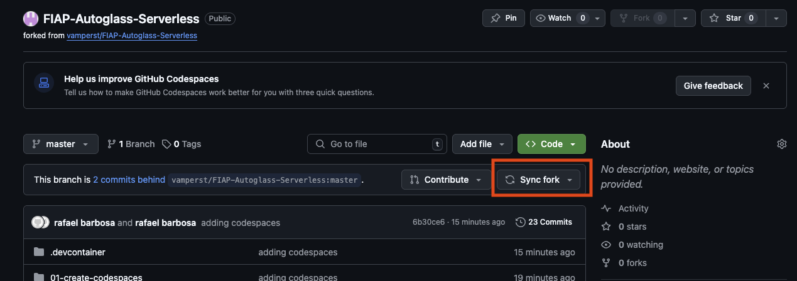

<!-- PRINT SUGERIDO: img/sync2.png
     Confirmação de sync concluído. -->
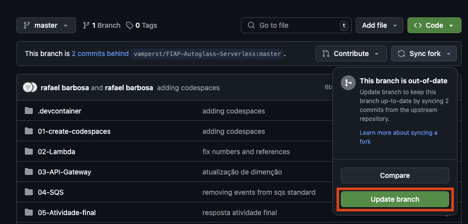

> [!NOTE]
> Se aparecer `This branch is not behind the upstream`, **está tudo OK** — não há labs novos para puxar. Siga para a Parte 2.

<!-- PRINT SUGERIDO: img/sync3.png
     Mensagem "This branch is not behind the upstream". -->
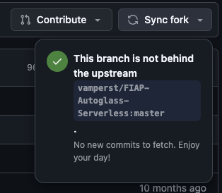

### Checkpoint

- [x] Fork sincronizado (ou já estava em dia com o upstream).

---

## Parte 2 - Reabrir Codespaces

### Resultado esperado desta parte

Codespaces rodando com o terminal aberto, repositório local atualizado via `git pull`.

3. Acesse [github.com/codespaces](https://github.com/codespaces).

4. Clique no Codespaces que você criou no setup (derivado de `fiap-cloud-engineering`). Se estiver `Stopped`, ele vai reiniciar automaticamente — leva ~30 segundos.

<!-- PRINT SUGERIDO: img/codespacess11.png
     Lista de Codespaces com o ambiente da disciplina destacado. -->
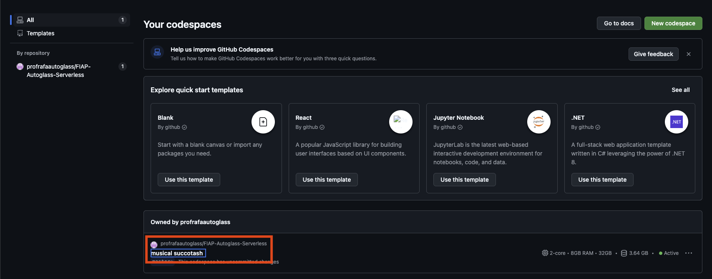

5. No terminal do Codespaces, atualize o repositório local para puxar o que você sincronizou no GitHub na Parte 1:

```bash
git pull origin main
```

### Checkpoint

- [x] Codespaces aberto e funcional.
- [x] `git pull` rodou sem conflito (normalmente retorna `Already up to date.` ou lista de arquivos atualizados).

<details>
<summary><b>⚠ Se der erro: <code>Your local changes would be overwritten by merge</code></b></summary>
<blockquote>

Você tem alterações locais não commitadas. Se são alterações que você quer preservar, faça `git stash`, depois `git pull`, depois `git stash pop`. Se são lixo de um lab anterior, faça `git checkout .` para descartá-las antes do pull.

</blockquote>
</details>

---

## Parte 3 - Iniciar o Learner Lab

### Resultado esperado desta parte

Sessão do AWS Academy Learner Lab iniciada, com a bolinha verde ao lado de `AWS` e credenciais temporárias disponíveis em `AWS Details`.

6. Acesse [AWS Academy](https://www.awsacademy.com/vforcesite/LMS_Login) e entre no curso `AWS Academy Learner Lab` que o professor informou.

<!-- PRINT SUGERIDO: img/ac1.png
     Painel do AWS Academy com o curso Learner Lab à vista. -->
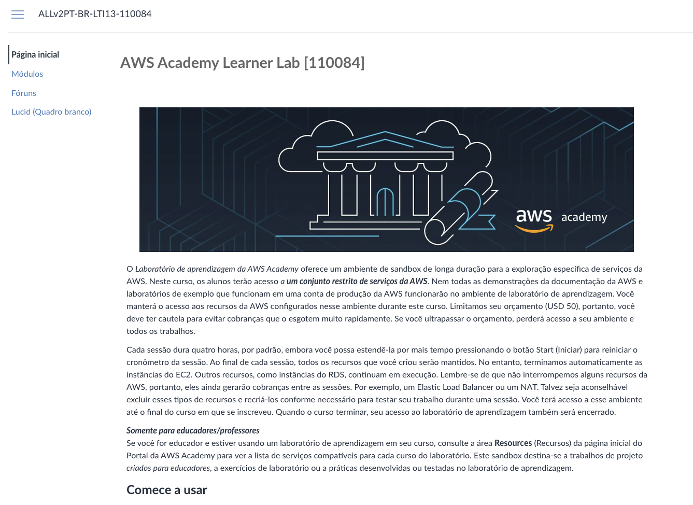

7. Na lateral esquerda, clique em `Módulos`.

<!-- PRINT SUGERIDO: img/ac2.png
     Menu lateral com "Módulos" destacado. -->
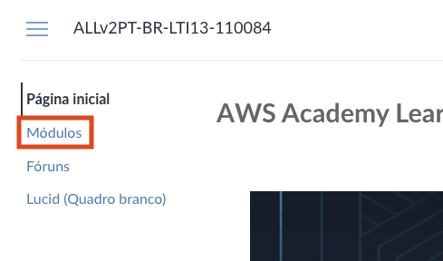

8. Clique em `Iniciar os laboratórios de aprendizagem da AWS Academy`.

<!-- PRINT SUGERIDO: img/ac3.png
     Link "Iniciar os laboratórios" à vista. -->
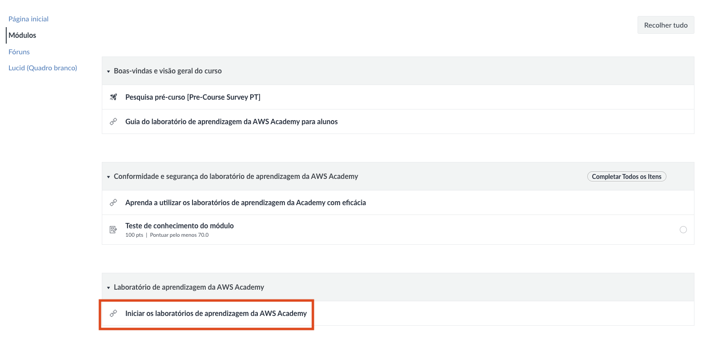

9. Clique em `Start Lab` e aguarde a bolinha ao lado de `AWS` ficar **verde** (leva 1-3 min).

<!-- PRINT SUGERIDO: img/ac4.png
     Tela do Learner Lab com o botão Start Lab clicado e status carregando. -->
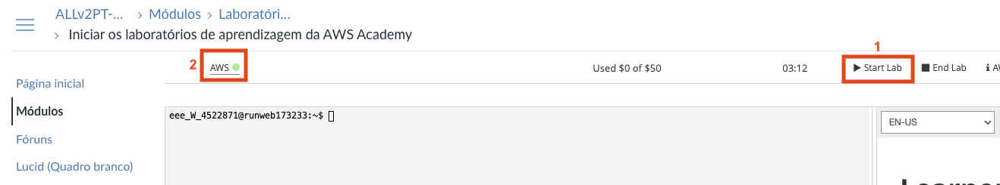

### Checkpoint

- [x] Bolinha `AWS` verde no topo da página.
- [x] Sessão de 4 horas iniciada.

---

## Parte 4 - Renovar credenciais no Codespaces

### Resultado esperado desta parte

Arquivo `~/.aws/credentials` no Codespaces com credenciais novas, e `aws s3 ls` respondendo sem erro.

10. Na aba do AWS Academy, clique em `AWS Details` no canto superior direito.

<!-- PRINT SUGERIDO: img/ac5.png
     Botão "AWS Details" no topo direito da página do Learner Lab. -->
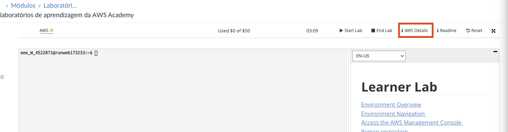

11. Na seção `AWS CLI`, clique em `Show` e copie todo o bloco de credenciais.

<!-- PRINT SUGERIDO: img/ac6.png
     Bloco de credenciais AWS CLI exibido após o "Show". -->
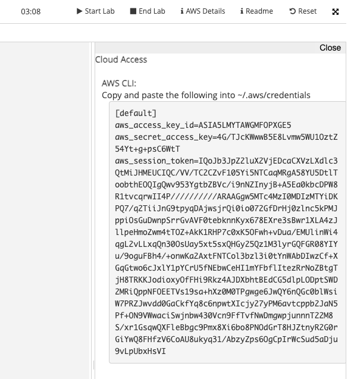

12. **No Codespaces**, abra o arquivo de credenciais:

```bash
code ~/.aws/credentials
```

13. Cole o conteúdo copiado, **substituindo tudo que já estava lá** (as credenciais antigas). Salve com `Ctrl+S` ou `Cmd+S`.

<!-- PRINT SUGERIDO: img/ac7.png
     Arquivo ~/.aws/credentials aberto no Codespaces com as credenciais novas coladas. -->
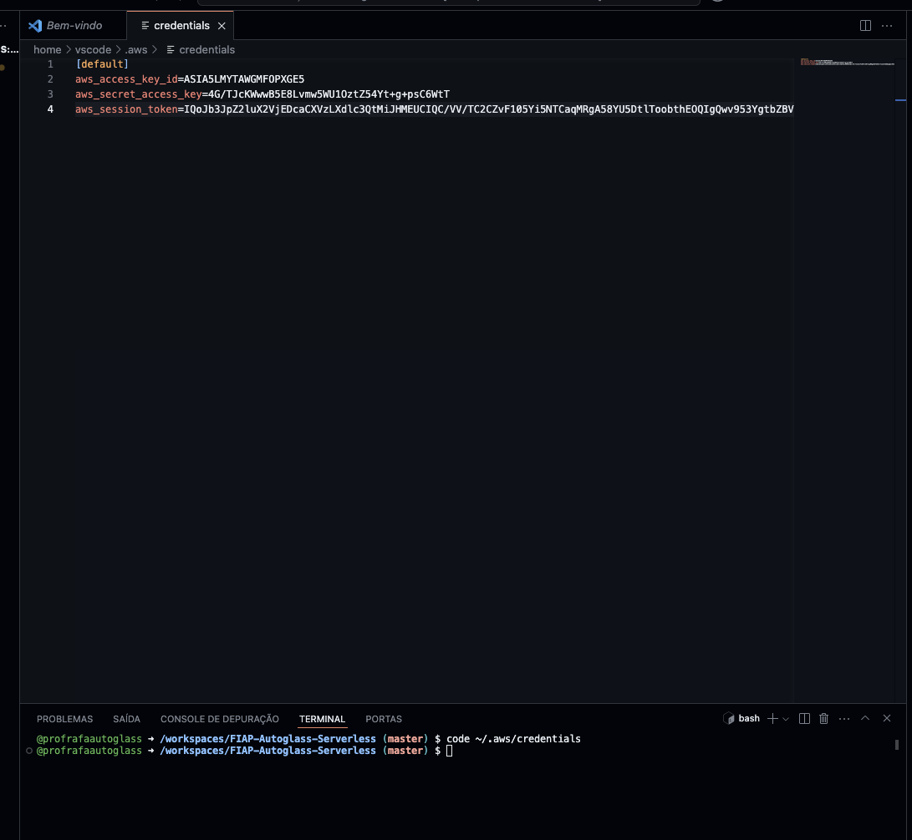

14. **Teste** — este é o checkpoint final do ritual:

```bash
aws s3 ls
```

Saída esperada: pelo menos uma linha com seu bucket `base-config-<SEU_RM>`.

### Checkpoint

- [x] `aws s3 ls` responde sem erro.
- [x] Bucket `base-config-<SEU_RM>` aparece na listagem.

<details>
<summary><b>⚠ Se der erro: <code>Unable to locate credentials</code> ou <code>ExpiredToken</code></b></summary>
<blockquote>

As credenciais novas não foram salvas corretamente. Verifique:

1. O arquivo `~/.aws/credentials` tem exatamente o bloco `[default]` colado da AWS Details (não `[Academy]` ou outro profile).
2. Você salvou o arquivo com `Ctrl+S`/`Cmd+S`.
3. A sessão do Learner Lab está com a bolinha verde (se ficou amarela no meio do caminho, faça `End Lab` e `Start Lab` de novo).

</blockquote>
</details>

---

## Pronto

Ambiente armado, credenciais frescas, pronto para o lab do dia. Agora vá direto para a URL do laboratório que o professor indicou no começo da aula.

> [!CAUTION]
> **Ao final da aula**, desligue o Codespaces em [github.com/codespaces](https://github.com/codespaces) → 3 pontinhos → `Stop Codespace`. Isso preserva suas 120h/mês gratuitas do plano estudante.

---

<details>
<summary><b>💡 Como pedir ajuda se travou</b></summary>
<blockquote>

**Antes de abrir issue ou chamar o professor, colete:**

1. Em qual parte (1, 2, 3 ou 4) travou.
2. A mensagem de erro **literal** (copie e cole).
3. O que `aws sts get-caller-identity` retorna (se chegou na Parte 4).
4. Se a bolinha do Learner Lab está verde, amarela ou vermelha.

**Canais, em ordem:**

1. [Issues deste repositório](https://github.com/vamperst/fiap-cloud-engineering/issues) — preferido, cria histórico pesquisável.
2. Email do professor com os 4 itens acima.
3. Na sala de aula, durante o laboratório.

</blockquote>
</details>
